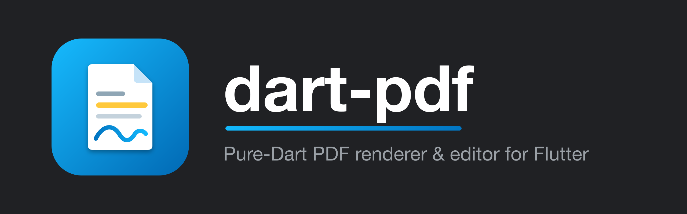
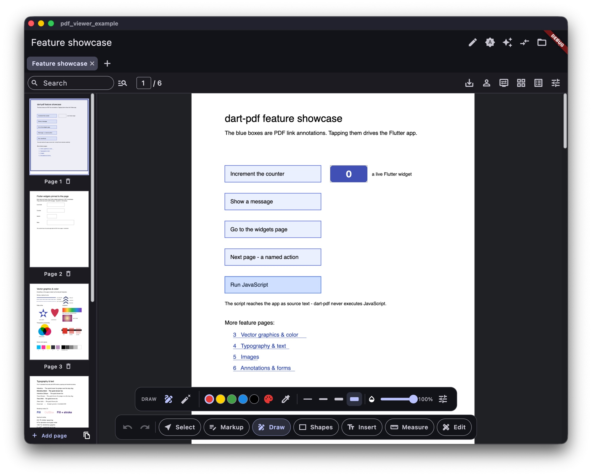

[](https://github.com/ben-milanko/dart-pdf/actions/workflows/ci.yml)
[](https://pub.dev/packages/dart_pdf_editor)
[](https://codecov.io/gh/ben-milanko/dart-pdf)
[](LICENSE)

> [!TIP]
> **Want the app, not the SDK?** [**DartPDF**](https://dart-pdf.com) is the
> official PDF editor built on this library. Edit, annotate, sign, and fill
> PDFs entirely on your device, with no account and no uploads. Get it at
> [dart-pdf.com](https://dart-pdf.com) or
> [open it in your browser](https://app.dart-pdf.com).

[](https://dart-pdf.com)

A PDF renderer and editor written entirely in Dart, for use in Flutter
apps. No PDFium, no platform channels.

The goal is a PSPDFKit-class SDK built natively for Flutter: a fast
viewer, a full annotation suite with appearance-stream generation,
AcroForm filling, page manipulation, and editing that preserves digital
signatures.

> Status: the roadmap below is complete. COS parsing with xref recovery,
> signature-preserving incremental updates with encrypt-on-write, a
> content-stream interpreter with TrueType/CFF/Type3 font rendering,
> mesh shadings, ICC color, pure-Dart CCITT/JBIG2/JPEG 2000 decoders, a
> zoomable Flutter viewer with text selection and search, inferred text
> reflow, annotation authoring and flattening, AcroForm filling, page
> manipulation, digital signatures with trust-store chain validation,
> content editing, and the full editing UI: tools, panels, forms,
> touch/stylus input, theming, and a sync surface for collaborative
> annotation stores.



Live demo: <https://dart-pdf-demo.web.app> (the example app built for
the web; it opens onto a six-page feature showcase, and the open button
loads your own PDF).

Visual render results: the checked-in
[PDF.js corpus comparison gallery](test_corpora/pdfjs/_renders/README.md)
shows PDF.js baselines, Dart renders, and diffs directly in GitHub.

## Performance

Pure Dart is not a compromise on speed. On a real-world corpus (49 files /
245 pages of CAD drawings, scans, reports, and forms), the parse +
content-stream **interpreter is ~1.5x faster than PDFium**: **13.6 ms/page
vs 20.6 ms/page** at scale 2. PDFium is the C++ engine Chrome uses. Full Flutter
rasterization runs at 53.7 ms/page (2.6× PDFium); that remaining gap is image
decoding and GPU raster + readback, not the interpreter.

| engine | ms/page | vs PDFium |
|---|---|---|
| dart-pdf interpret (pure Dart, no raster) | **13.6** | **1.52x faster** |
| PDFium (open + rasterize) | 20.6 | 1.00× |
| dart-pdf render (full Flutter raster) | 53.7 | 2.60x slower |

The benchmark suite ships reproducible harnesses that diff dart-pdf against
PDFium via `pypdfium2`, file by file. See [`benchmark/`](benchmark).

## Architecture

Strictly layered packages; `dart:ui` is only allowed in `dart_pdf_editor`, so
the core runs on servers and in plain Dart tests. Each package is
published on pub.dev under its directory name.

| Package | pub.dev | Role |
|---|---|---|
| [`pdf_cos`](packages/pdf_cos) | [](https://pub.dev/packages/pdf_cos) | The PDF file format itself: tokenizer, parser, filters (incl. CCITT/JBIG2/JPX), encryption, cross-reference machinery, serializer, crypto primitives. |
| [`pdf_document`](packages/pdf_document) | [](https://pub.dev/packages/pdf_document) | Document semantics: page tree, annotations, AcroForm, digital signatures, and the incremental-save `PdfEditor`. |
| [`pdf_graphics`](packages/pdf_graphics) | [](https://pub.dev/packages/pdf_graphics) | Content-stream interpreter, device interface, font engine, ICC color, text extraction. |
| [`dart_pdf_editor`](packages/dart_pdf_editor) | [](https://pub.dev/packages/dart_pdf_editor) | Flutter viewer and editing UI: canvas device, `PdfViewer`, tools, panels, forms. |
| [`pdf_ocr_ondevice`](packages/pdf_ocr_ondevice) | [](https://pub.dev/packages/pdf_ocr_ondevice) | Optional on-device OCR engine for native Flutter apps; downloads a small PP-OCR model once and adds searchable text layers offline. |
| [`pdf_ocr_vlm`](packages/pdf_ocr_vlm) | [](https://pub.dev/packages/pdf_ocr_vlm) | Optional HTTP OCR engine for web, mobile, and desktop; talks to dots.ocr/vLLM or any service returning text boxes. |
| [`pdf_test_fixtures`](packages/pdf_test_fixtures) | [](https://pub.dev/packages/pdf_test_fixtures) | Programmatic, structurally-correct PDF builders for tests. |

## Quick start

For a Flutter app, add the editor package:

```sh
flutter pub add dart_pdf_editor
```

Then give the drop-in shell PDF bytes and bounded space:

```dart
import 'package:dart_pdf_editor/dart_pdf_editor.dart';

PdfEditorView(
  bytes: pdfBytes,
  onSave: (bytes) => saveBytesSomewhere(bytes),
)

PdfReader(bytes: pdfBytes)
```

For OCR, add one engine package and call `PdfEditor.applyOcr` before opening
or replacing the document in your viewer:

```sh
flutter pub add pdf_ocr_ondevice   # native offline OCR
# or
flutter pub add pdf_ocr_vlm        # HTTP OCR, including Flutter web
```

`pdf_ocr_ondevice` is the simplest native path: it downloads the default model
once, caches it in app support storage, then runs offline. `pdf_ocr_vlm` is the
simplest web/server path: point it at a CORS-enabled OCR service. Both write the
same invisible text layer, so scanned pages become selectable, searchable, and
copyable without changing how the PDF looks.

## Roadmap

1. ✅ COS reader: lexer, parser, FlateDecode + predictors, xref tables,
   xref streams, object streams
2. ✅ Incremental-update writer (signature-preserving); first edits:
   metadata, page rotation
3. ✅ Encryption: opening RC4/AES-128/AES-256 documents (user and owner
   passwords) and encrypt-on-write, so encrypted documents are editable.
   Signing them is still refused, since the signature byte ranges must
   stay plaintext-patchable.
4. ✅ Content-stream interpreter with an abstract device interface
5. ✅ Font engine: TrueType/CFF glyph outlines, CID fonts, CMaps, ToUnicode
6. ✅ Flutter rendering device + viewer widget
7. ✅ Text extraction with positions, feeding selection and search
   plus paragraph/reading-order inference for text reflow
8. ✅ Annotations: model, appearance-stream rendering, authoring with
   generated appearances (highlight/underline/strike-out/squiggly, ink,
   shapes, free text, notes, stamps), and flattening
9. ✅ AcroForm: field model (text, check box, radio, choice), filling
   with regenerated appearances (auto-size, multiline wrap, quadding,
   /MK decorations), and template editing: field metadata, creating
   fields on any document, renaming, deleting, retyping, image-filled
   push buttons, and fault-tolerant whole-form flattening
10. ✅ Page manipulation: reorder/move, remove, merge with cross-document
    object copying (`appendPagesFrom`), and split (`extractPages` writes
    a standalone file; extracting from an encrypted document decrypts)
11. ✅ Digital signatures: validation (CMS/PKCS#7 with RSA and ECDSA
    P-256/384/521, byte-range and revision-coverage checks) and signing
    (`saveSigned`, adbe.pkcs7.detached, RSA-SHA256, verified
    interoperable with OpenSSL and poppler)
12. ✅ Content editing: stamping (`stampPage`, text, shapes, JPEG and
    PNG images over existing content), element deletion
    (`PdfPageElements` + `deleteElements`), and text editing
    (`replaceText`, simple fonts, within one shown string; no reflow)

Deliberately deferred: richer text editing beyond single shown-string
rewrites, RSASSA-PSS signatures, JBIG2 Huffman/refinement variants, and
JPX subsampling/PCRL-CPRL progressions.

## Features

### Viewer

- Zooming/panning viewer with fit-page and fit-width modes, and
  deep-zoom detail rendering past the raster caps.
- Text selection with mouse or touch (long-press, then drag handles),
  full-text search, link navigation, outlines.
- Reader reflow mode infers visual lines, columns, reading order, and
  paragraphs from positioned text, then presents a continuous selectable
  text view for narrow screens.
- Custom always-visible scrollbars that stay usable while zoomed; a
  horizontal bar appears for panning the zoom window. Scroll metrics are
  computed from real page heights, so the thumb doesn't jump around on
  long documents with mixed page sizes.
- Trackpad pinch and scroll don't fight each other (each gesture commits
  to one or the other), touch pinch zoom works with a tool armed, and
  flings keep their momentum, including finger scrolls while an editing
  tool owns the gestures.
- Navigation (search results, links, thumbnails) accounts for the zoom
  window, so jumps land where the user is looking.
- Pages skip their first interpretation during fast flings and fill in
  when the scroll settles, which keeps heavy CAD documents smooth.
- Dark mode, arbitrary page background colors (`PdfViewer.pageColor`),
  chrome theming via `PdfViewerTheme`, and a hide-all-annotations
  toggle.

### Annotation editing

- `PdfEditingController` saves incrementally on every edit, so revisions
  are byte prefixes of one buffer and undo/redo is essentially free.
- Tools: text markup (highlight/underline/strikeout/squiggly), ink,
  shapes, free text, notes, stamps (including saved custom stamps), and
  a saved ink signature.
- Selection works like a desktop editor: click, rubber-band marquee,
  shift/⌘-click toggle, ⌘A; move, resize, and rotate with live
  appearance previews and zoom-invariant chrome that follows rotated
  annotations without shearing.
- Shapes and text boxes regenerate their appearance on resize, keeping
  stroke width and font size constant (text re-wraps, in the preview
  too).
- The eraser slices ink: it removes exactly the stroke segments under
  the swept circle, splitting strokes where it crosses them.
- Copy/cut/paste via keyboard and context menu; copies are deep
  snapshots that survive undo and paste into other documents. Z-order
  edits reorder the page's /Annots array so they stick in any viewer.
  Touch reaches the same context menu with a long-press (on an
  annotation, a form field, or empty page area when the clipboard has
  something to paste).
- In-place restyling: color, stroke width, opacity, font, and size of
  the selected annotations, preserving identity, z-order, and authors.
- Commits never flash: the overlay keeps the committed preview painted
  until the page re-render reaches the screen.
- Text boxes edit in place with an inline editor matching the committed
  font, size, color, and fill; Helvetica/Times/Courier with proper AFM
  metrics.
- Stylus support: pressure-variable ink width, Catmull-Rom stroke
  smoothing, palm rejection, instant stroke start, dot taps, and
  inverted-pencil erasing. Ink auto-commits about a second after the
  pen lifts.

### Forms

- Fill text, checkbox, radio, and choice fields in place; push-button
  fields take an image (the usual carrier for signatures and logos).
- Fields are highlighted with a translucent wash and border by default
  (`PdfViewer.highlightFormFields`), so they're findable at a glance.
- Field administration (add, rename, retype, delete, flatten) is
  available both as an API and in the UI via drag-out creation and a
  right-click menu.

### OCR

- `PdfEditor.injectTextLayer` writes already-recognized `PdfOcrSpan`s as an
  invisible PDF text layer. The original scan remains visually unchanged, but
  selection, search, copy, and text extraction start working.
- `PdfEditor.applyOcr(pageIndex, engine)` renders the page, calls a pluggable
  `PdfOcrEngine`, maps raster boxes back through crop boxes and `/Rotate`, and
  injects the layer for you.
- `pdf_ocr_ondevice` supplies a native offline engine backed by ONNX Runtime
  and a downloadable PP-OCR model. `pdf_ocr_vlm` supplies an HTTP engine for
  dots.ocr/vLLM, cloud VLMs, or a small adapter around Tesseract/PaddleOCR.
  Hosts can also implement `PdfOcrEngine` directly.

### Panels and navigation chrome

- Thumbnail sidebar: tap to jump, drag to reorder, delete, with a live
  viewport indicator. Tiles render into an LRU cache keyed by per-page
  render stamps, so an edit only re-renders the pages it touched.
- Annotation sidebar with live filtering and multi-select delete;
  tapping a tile zooms to the annotation and pulses an attention ring.
- Properties panel: type, page, color, fill, stroke width, opacity,
  font, contents, author, and numeric position/size, all editable.
- Search results panel with context snippets, plus `PdfSearchField` and
  an editable `PdfPageNumberField` ("3 / 12") for app bars.
- All panels resize by dragging their inner edge. Panel widths, colors,
  stroke width, fonts, theme mode, and the rest of the UI preferences
  persist on the device (`PdfEditingPreferences`, backed by
  `shared_preferences`).
- A full color picker (`PdfColorPicker`) with hex/RGB/HSL/CMYK entry and
  an eyedropper that samples from the rendered page.

### Collaboration

- Every authored annotation carries a generated /NM name (the spec's own
  identifier), giving it durable identity across moves, restyles, and
  rewrites.
- `PdfAnnotationSnapshot` serializes to JSON with the appearance stream
  included, so a synced annotation renders identically on every device.
- `annotationChanges` emits per-revision diffs (created/modified/removed,
  undo and redo included); `applyRemoteChange` replays remote edits
  without echoing them back. Two controllers piped together converge.
- Permissions: the document's /F ReadOnly and Locked flags are honored,
  and a `canEditAnnotation` predicate covers policies like "users may
  only edit their own annotations". Gated annotations still render and
  list; they just can't enter the selection.

## Development

This repo uses [fvm](https://fvm.app) (Flutter 3.44.2) and pub workspaces.

```sh
fvm flutter pub get          # resolve the whole workspace
fvm dart analyze
cd packages/pdf_cos && fvm dart test
```

The example app (`packages/dart_pdf_editor/example`) runs on macOS, iOS,
Android, web, Windows, and Linux, with platform-native file handling:
the system picker to open, and a save dialog, browser download, or share
sheet to save, depending on the platform.

It opens onto a generated six-page feature showcase: PDF link/JavaScript
actions driving the Flutter app and live widgets pinned onto the page,
a vector-graphics page (dashes, joins, Bézier fills, stitched axial and
radial shadings, blend modes, constant alpha, CMYK/gray swatches), a
typography page (the standard fonts, rendering modes, spacing/scaling
operators, text transforms), an images page (RGB XObjects, color-key
masks, 1-bit stencils, inline images), and an annotations & forms page
whose markup, shapes, stamp, note, and filled form fields are authored
through the editor API while the document is generated, so the demo
doubles as a smoke test of the authoring pipeline.

### Rendering test suite

`test_corpora/ghent/` carries the [Ghent PDF Output Suite
V5.0](https://gwg.org/), 54 print-conformance PDFs covering overprint,
DeviceN/spot color, ICC v2/v4, 16-bit images, transparency blend modes,
softmasks, optional content, font formats, and JBIG2/JPEG 2000
compression. Two layers run over it:

- `pdf_graphics/test/ghent_corpus_test.dart` interprets every page on
  the plain Dart VM (parse + paint-op assertions, no rasterization).
- `dart_pdf_editor/test/ghent_render_test.dart` rasterizes every page and
  compares it pixel-wise against checked-in baseline renders;
  regressions dump actual/diff images for inspection, and
  `GHENT_UPDATE=1` re-baselines after an intentional change.

`test_corpora/pdfjs/` carries 171 real-world edge-case PDFs curated from
the [mozilla/pdf.js](https://github.com/mozilla/pdf.js) test suite:
fuzzed crashers (poppler, pdfbox, ghostscript cases), lying xrefs and
page-tree /Counts, junk inside content streams, odd font programs,
filter and encryption corner cases. Where Ghent pins print-production
features, this corpus pins robustness. Per-file expectations record
which files open, which fail with a controlled exception, which need
passwords, and which legitimately render blank (see the README in the
corpus directory for provenance and per-file notes). Two layers again:
`pdf_graphics/test/pdfjs_corpus_test.dart` (pure-Dart open + interpret)
and `dart_pdf_editor/test/pdfjs_render_test.dart` (rasterization smoke over
the real decode pipeline, with optional PDF.js baseline comparison).
Checked-in PDF.js reference PNGs live under
[`test_corpora/pdfjs/_baselines`](test_corpora/pdfjs/_baselines), and the
latest checked-in side-by-side visual results are browsable from
[`test_corpora/pdfjs/_renders/README.md`](test_corpora/pdfjs/_renders/README.md).

Run the checked-in corpora from their package directories so the relative
`../../test_corpora/...` paths line up:

- Ghent pure-Dart pass: `cd packages/pdf_graphics && fvm dart test test/ghent_corpus_test.dart`
- Ghent render/baseline pass: `cd packages/dart_pdf_editor && fvm flutter test test/ghent_render_test.dart`
- Accept intentional Ghent baseline changes: `cd packages/dart_pdf_editor && GHENT_UPDATE=1 fvm flutter test test/ghent_render_test.dart`
- Ghent visual review gallery: `cd packages/dart_pdf_editor && GHENT_RENDER_OUT=../../test_corpora/ghent/_renders fvm flutter test test/ghent_render_test.dart`, then open `test_corpora/ghent/_renders/index.html`
- PDF.js pure-Dart pass: `cd packages/pdf_graphics && fvm dart test test/pdfjs_corpus_test.dart`
- PDF.js render smoke pass: `cd packages/dart_pdf_editor && fvm flutter test test/pdfjs_render_test.dart`
- PDF.js visual review gallery: `cd packages/dart_pdf_editor && PDFJS_RENDER_OUT=../../test_corpora/pdfjs/_renders fvm flutter test test/pdfjs_render_test.dart`, then open `test_corpora/pdfjs/_renders/index.html`
- Generate PDF.js reference baselines: `cd packages/dart_pdf_editor/tool/pdfjs_baseline && npm install && npm run render`
- PDF.js pixel compare + side-by-side results: `cd packages/dart_pdf_editor && PDFJS_BASELINE_DIR=../../test_corpora/pdfjs/_baselines fvm flutter test test/pdfjs_render_test.dart`, then open `test_corpora/pdfjs/_renders/index.html`
- Rebuild the checked-in PDF.js gallery index without rerendering: `fvm dart packages/dart_pdf_editor/tool/rebuild_pdfjs_render_index.dart`
- All checked-in corpus tests: run the four non-update test commands above
  (excluding the visual galleries); they are intentionally split because
  `pdf_graphics` is VM-only and `dart_pdf_editor` needs Flutter rasterization.

The Ghent gallery writes the same 2x rasters used for baseline comparison.
The PDF.js gallery writes the same pages as the smoke pass by default (up to
five per file at 1x); override it with `PDFJS_RENDER_MAX_PAGES` and
`PDFJS_RENDER_PIXEL_RATIO` when you need deeper or sharper review. When
`PDFJS_BASELINE_DIR` is set, the Flutter test compares Dart rasters against
the PDF.js baselines using `PDFJS_COMPARE_CHANNEL_TOLERANCE` (default 8) and
`PDFJS_COMPARE_MAX_DIFF_FRACTION` (default 0.0005), and writes
`test_corpora/pdfjs/_renders/index.html` unless `PDFJS_RENDER_OUT` overrides
the output directory. The results page shows each page as one row with the
PDF.js baseline, Dart render, and diff side by side.

If you have the private `corpus/` directory locally, use it for broader
real-world coverage:

- Parse check: `cd packages/pdf_document && fvm dart tool/inspect.dart ../../corpus/*.pdf`
- Single render check: `cd packages/dart_pdf_editor && PDF_PATH=../../corpus/<file>.pdf PDF_PAGE=0 fvm flutter test test/render_smoke_test.dart`
- Full render sweep: `cd packages/dart_pdf_editor && CORPUS_DIR=../../corpus RENDER_OUT=../../corpus/renders fvm flutter test test/corpus_render_test.dart`
